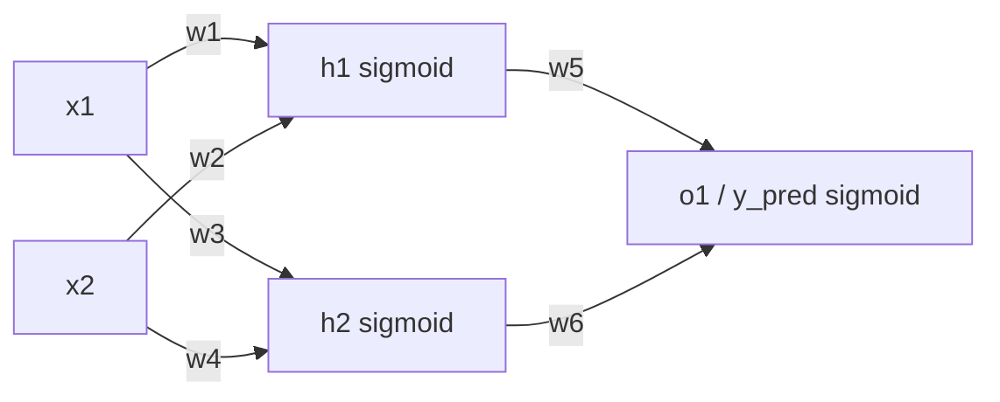
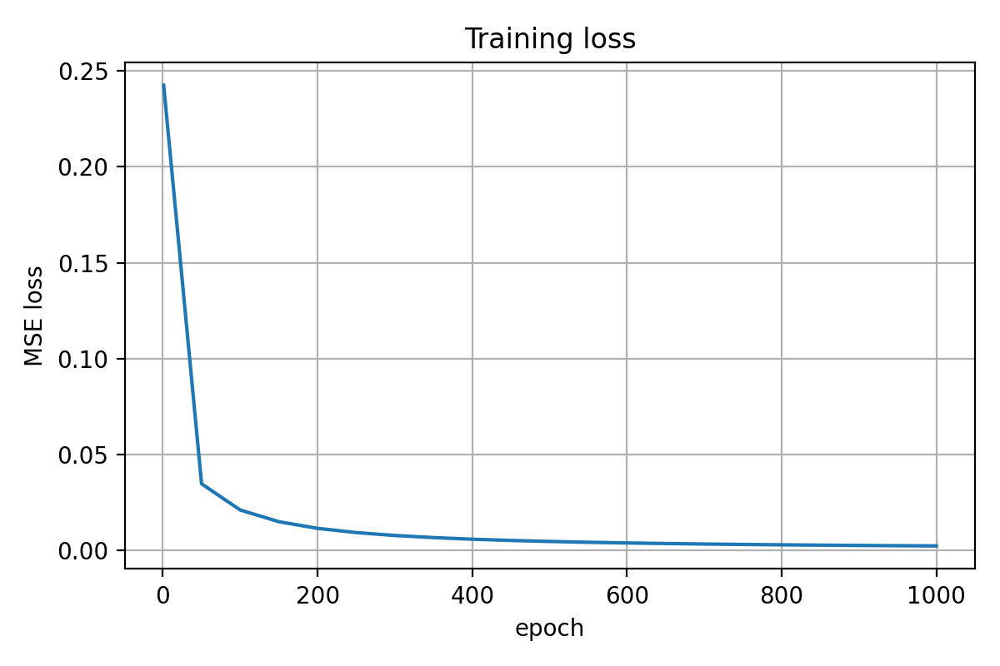
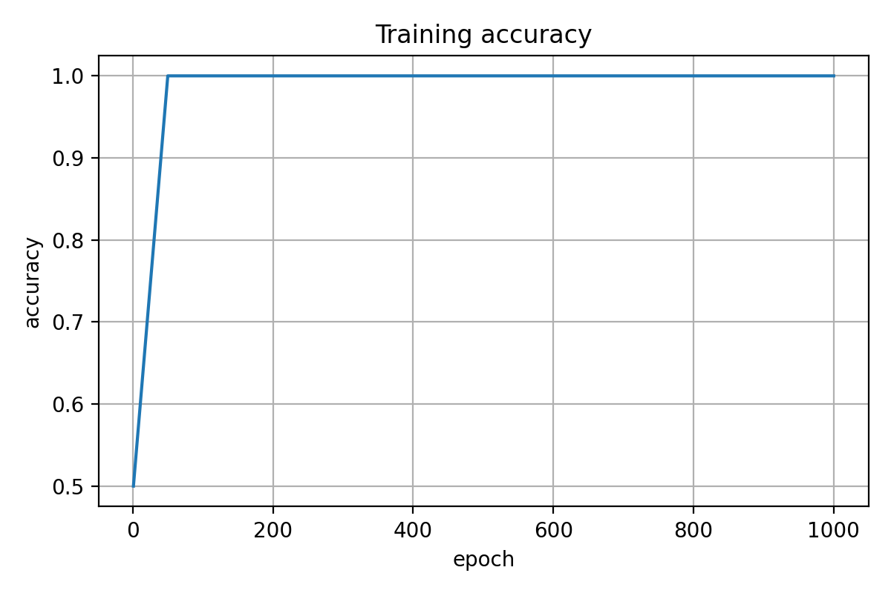
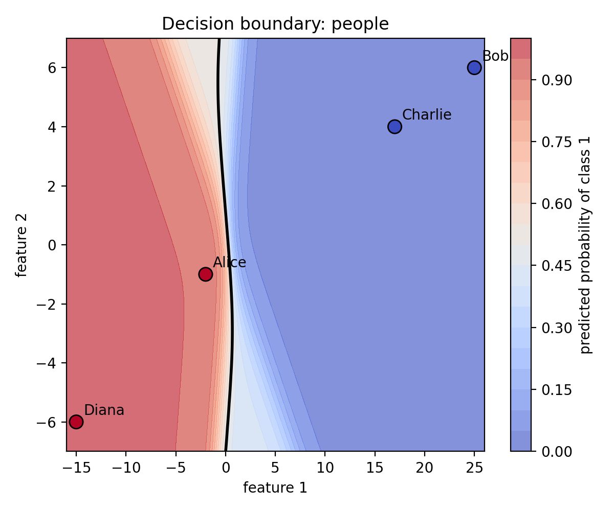
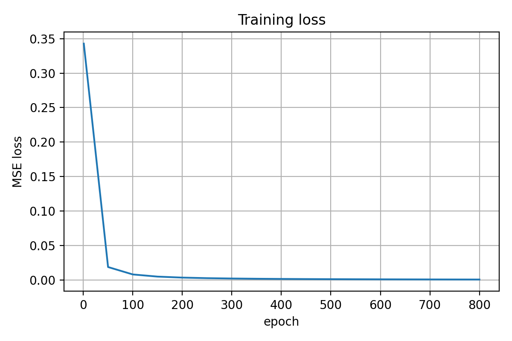
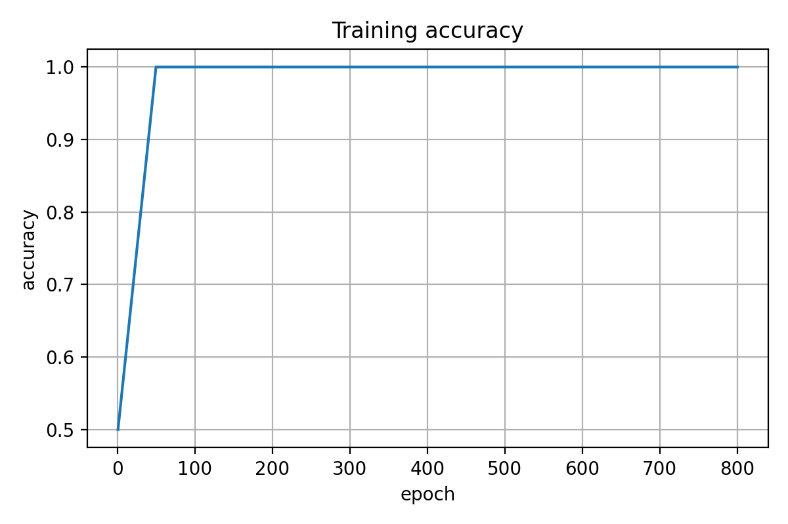
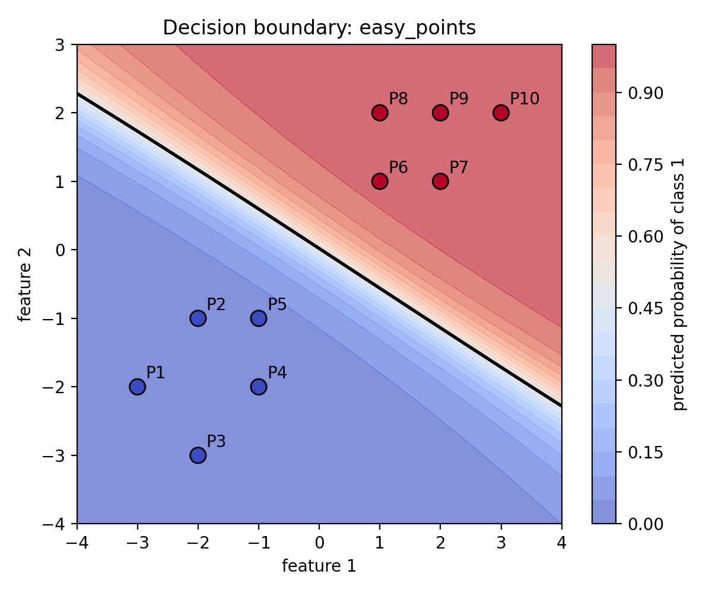

# Neural Network From Scratch in Python


A beginner-friendly neural network project built from scratch with **NumPy** and **Matplotlib**.

This project was inspired by Victor Zhou’s article **“Machine Learning for Beginners: An Introduction to Neural Networks”** and expands the original tiny example into a complete learning repository with:

* a real project structure
* small CSV datasets
* explicit feedforward code
* manual backpropagation
* unit tests
* saved plots
* GitHub Actions CI

## Why I built this

I wanted to learn machine learning by writing the logic myself instead of hiding everything behind a framework on day one.

This repo is intentionally small enough to understand fully, but structured enough to look like a real project on GitHub.

## What this project teaches

* how a neuron computes a weighted sum plus bias
* why sigmoid changes the shape of the computation
* how mean squared error measures prediction error
* how backpropagation uses the chain rule
* how stochastic gradient descent updates parameters
* how to structure, test, and document a small Python repo

## Network shape



This project uses a tiny neural network with this shape:

```text
2 inputs -> 2 hidden neurons -> 1 output neuron
```

The core forward-pass equations are:

```text
sum_h1 = w1*x1 + w2*x2 + b1
h1 = sigmoid(sum_h1)

sum_h2 = w3*x1 + w4*x2 + b2
h2 = sigmoid(sum_h2)

sum_o1 = w5*h1 + w6*h2 + b3
y_pred = sigmoid(sum_o1)
```

## Project structure

```text
.
├── .github/
│   └── workflows/
│       └── tests.yml
├── data/
│   ├── people_train.csv
│   ├── people_predict.csv
│   └── easy_points.csv
├── nn_scratch/
│   ├── __init__.py
│   ├── math_utils.py
│   ├── datasets.py
│   ├── network.py
│   ├── visualize.py
│   └── train.py
├── tests/
│   ├── test_dataset.py
│   ├── test_math_utils.py
│   └── test_network.py
├── figures/
│   └── generated/
├── artifacts/
├── .gitignore
├── README.md
└── requirements.txt
```

## Setup on CachyOS with Fish shell

Create the virtual environment:

```fish
python -m venv .venv
```

Activate it with Fish:

```fish
source .venv/bin/activate.fish
```

Install dependencies:

```fish
python -m pip install --upgrade pip
python -m pip install -r requirements.txt
```

## Run tests

```fish
python -m unittest discover -s tests -p "test_*.py" -v
```

Expected result:

```text
Ran 13 tests

OK
```

## Train on the article dataset

```fish
python -m nn_scratch.train --dataset people --epochs 1000 --learning-rate 0.1
```

This trains on the small article-style people dataset using shifted weight and height features.

Example result:

```text
epoch 1000 | loss = 0.002192 | accuracy = 1.000
```

The script also predicts the extra article-style examples:

```text
Emily -> class 1
Frank -> class 0
```

## Train on the easy plotting dataset

```fish
python -m nn_scratch.train --dataset easy_points --epochs 800 --learning-rate 0.1 --shuffle
```

This trains on a cleaner 2D dataset that makes the decision-boundary plot easier to read.

Example result:

```text
epoch 800 | loss = 0.000741 | accuracy = 1.000
```

## Outputs

After training, the project saves:

* training history CSV
* learned parameters JSON
* prediction CSVs
* sigmoid and sigmoid-derivative plots
* loss and accuracy curves
* decision-boundary plots

Generated files are saved under:

```text
artifacts/<dataset>/
figures/generated/<dataset>/
```

Example artifact paths:

```text
artifacts/people/history.csv
artifacts/people/parameters.json
artifacts/people/train_predictions.csv
artifacts/people/article_prediction_examples.csv

artifacts/easy_points/history.csv
artifacts/easy_points/parameters.json
artifacts/easy_points/train_predictions.csv
```

Example figure paths:

```text
figures/generated/people/people_sigmoid.png
figures/generated/people/people_sigmoid_derivative.png
figures/generated/people/people_loss.png
figures/generated/people/people_accuracy.png
figures/generated/people/people_decision_boundary.png

figures/generated/easy_points/easy_points_sigmoid.png
figures/generated/easy_points/easy_points_sigmoid_derivative.png
figures/generated/easy_points/easy_points_loss.png
figures/generated/easy_points/easy_points_accuracy.png
figures/generated/easy_points/easy_points_decision_boundary.png
```

## Example figures

After you train once and commit selected generated figures, these image links will render directly on GitHub.

### People dataset loss curve



### People dataset accuracy curve



### People dataset decision boundary



### Easy points loss curve



### Easy points accuracy curve



### Easy points decision boundary



## How to read the plots

| Plot                       | What to look for                              | What it teaches                               |
| -------------------------- | --------------------------------------------- | --------------------------------------------- |
| `*_sigmoid.png`            | S-shaped curve from near 0 to near 1          | why outputs stay bounded                      |
| `*_sigmoid_derivative.png` | peak around 0, smaller at extremes            | why sigmoid learns fastest near the middle    |
| `*_loss.png`               | downward trend over epochs                    | whether training is reducing error            |
| `*_accuracy.png`           | upward trend on tiny datasets                 | whether predictions are becoming more correct |
| `*_decision_boundary.png`  | contour splitting class 0 and class 1 regions | how hidden units create decision regions      |

## What I learned

* how to translate neural-network math into Python code
* how to inspect intermediate values instead of guessing
* how to write tests against hand-worked examples
* how feedforward turns inputs into predictions
* how backpropagation computes parameter gradients
* how stochastic gradient descent updates weights and biases
* how to use a virtual environment on CachyOS with Fish shell
* how to save training artifacts and generated plots
* how to package a tutorial idea as a real GitHub portfolio project

## Credits

Inspired by Victor Zhou’s article **“Machine Learning for Beginners: An Introduction to Neural Networks”** and his companion repository.

* Article: https://victorzhou.com/blog/intro-to-neural-networks/
* Original companion repo: https://github.com/vzhou842/neural-network-from-scratch

If you directly reuse his code, preserve the MIT license terms. If you write your own version from the same idea, still give credit clearly.

## Next improvements

* replace the hand-shifted features with mean-centering
* add an XOR dataset
* compare mean squared error with cross-entropy loss
* compare sigmoid hidden units with ReLU
* animate the decision boundary over training
* build an RNN or CNN from scratch as a follow-up project

## License

MIT
